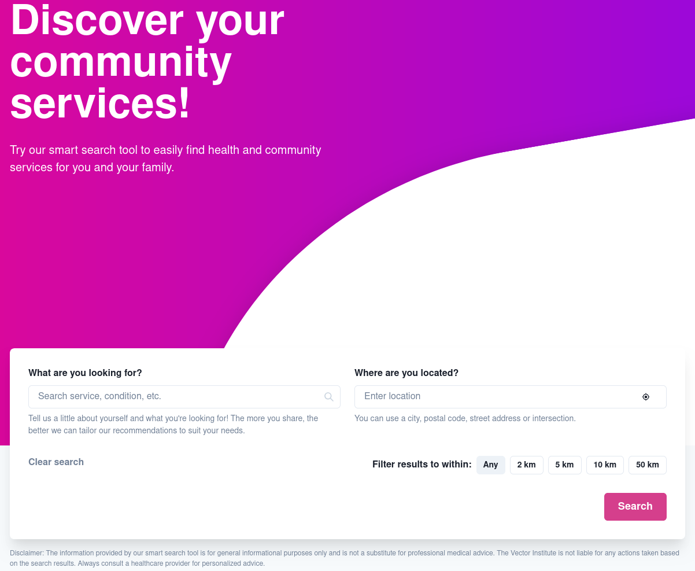
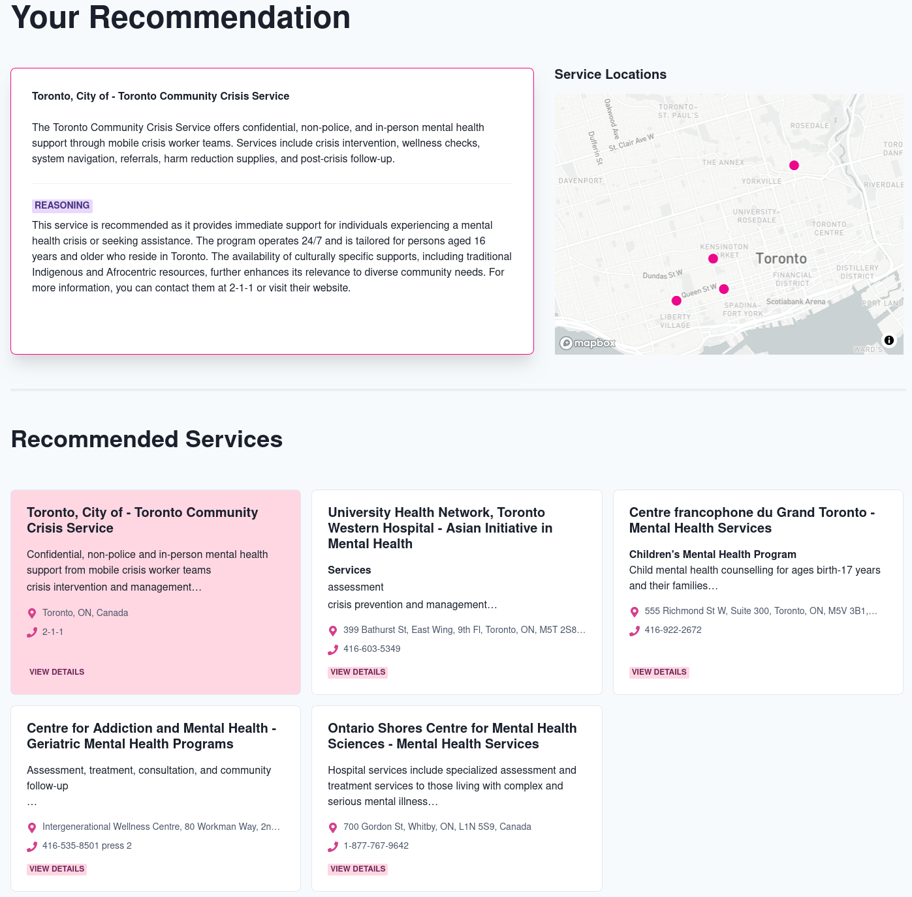

# Health Recommendation System

Welcome to the Health Recommendation System documentation! This system helps connect people with health and community services using AI-powered recommendations.

## 🌟 Overview

The Health Recommendation System is built with a modern microservices architecture:

| Component | Technology | Purpose |
|-----------|------------|----------|
| Frontend | Next.js | User interface |
| Backend | FastAPI | API services |
| Vector Database | ChromaDB | Service data storage |
| AI Engine | OpenAI | Embeddings & recommendations |

This tool is a Minimum Viable Product (MVP) designed for organizations looking to implement AI-powered health or community service recommendation systems. It can be adapted by healthcare providers, social service agencies, community organizations, and government entities who want to connect individuals with appropriate resources based on their specific needs.

The system features an intuitive interface that allows users to:
- Search for services using natural language queries
- Filter results by location
- View detailed information about each service
- Refine recommendations based on user feedback


*The main search interface where users can input their needs*


*Search results displaying services with an interactive map*

For API documentation, see the [API Reference](https://vectorinstitute.github.io/health-rec/api) or the local [API Documentation](docs/api.md).

## 🚀 Getting started

### Prerequisites

Make sure you have these tools installed:

- Docker & Docker Compose (v20.10.0+)
- Python (3.11+)
- Node.js (18.0.0+)
- uv (0.6.0+)

Note: the project is only tested with python 3.11, and it is recommended to use the same version.

### 🔑 API keys setup

Create a `.env.development` file in the project root:

```bash
# Required Keys
OPENAI_API_KEY=your_openai_key
211_API_KEY=your_211_key
DATA_DIR=/path/to/data
COLLECTION_NAME=your_collection_name

# Optional Frontend Keys
MAPBOX_API_KEY=your_mapbox_key
NEXT_PUBLIC_GOOGLE_MAPS_API_KEY=your_google_maps_key
```

### 🛠️ Installation

The python development environment can be set up using
[uv](https://github.com/astral-sh/uv?tab=readme-ov-file#installation). Hence, make sure
it is installed.

1. **Clone and setup backend**
   ```bash
   # Clone repository
   git clone https://github.com/VectorInstitute/health-rec.git
   cd health-rec

   # Install dependencies
   uv sync --dev

   # Activate virtual environment
   source .venv/bin/activate  # On Windows: .venv\Scripts\activate
   ```

2. **Run pre-commit checks**

```bash
pre-commit run --all-files
```

### 🏃‍♂️ Running the services

**Backend only**

```bash
docker compose --env-file .env.development -f docker-compose.dev.yml up
```

**UI and Backend**

```bash
docker compose --env-file .env.development --profile frontend -f docker-compose.dev.yml up
```

### 📥 Data setup

For a detailed description of the data schema used for the recommendation engine, see [Data Schema](https://vectorinstitute.github.io/health-rec/schema) or the local [Data Schema](docs/schema.md).

#### Test data

If you want to test the system without real data, you can generate some dummy testing data:

```bash
python3 scripts/generate_test_data.py --output-dir <path_to_output_dir>
```

This would create a file `<path_to_output_dir>/test_data/data-00.json` with about 300 dummy services.
You can follow the next step to load this data and embeddings to ChromaDB.

#### Download service data

If you are using the 211 API or Empower's API, make sure you check with them to see if the API keys are
configured correctly for the geography of interest. The scripts fetch data from the respective APIs and
transforms them to be compatible with the data schema described above.

**GTA data (211 API)**

```bash
python3 scripts/download_211_data.py --api-key $YOUR_211_API_KEY --dataset on --is-gta --data-dir <path_to_data_dir>
```

**Ontario-wide data (211 API)**

```bash
python3 scripts/download_211_data.py --api-key $YOUR_211_API_KEY --dataset on --data-dir <path_to_data_dir>
```

**Ontario-wide data including Connex data (211 API)**

```bash
python3 scripts/download_211_data.py --api-key $YOUR_211_API_KEY --dataset 211CX --data-dir <path_to_data_dir>
```

**Download only Connex data (211 API)**

```bash
python3 scripts/download_connex_data.py --api-key $YOUR_211_API_KEY  --output-dir <path_to_data_dir>
```

**Empower API data**

```bash
python3 scripts/download_empower_data.py --api-key $YOUR_EMPOWER_API_KEY --data-dir <path_to_data_dir>
```

#### Upload data and embeddings

First we use an interactive container:

```bash
docker run -it --network health-rec_app-network -v <path_to_data_dir_with_json_files>:/data -v `pwd`:/workspace -w /workspace vectorinstitute/health-rec:backend-dev-latest bash
source health_rec/.venv/bin/activate
```

Then we can run the following commands to upload the data to the vector database:

**Note**: Replace `<collection_name>` with the name of the collection you want to create. The default collection name specified in the `.env.development` file is `test`.

```bash
python3 health_rec/manage_data.py create --collection_name <collection_name>
OPENAI_API_KEY=$YOUR_OPENAI_API_KEY python3 health_rec/manage_data.py load --collection_name <collection_name> --resource_name <resource_name> --data_dir /data --load_embeddings
python3 health_rec/manage_data.py list
```

#### Remove data

To remove specific data entries from a collection:

```bash
python3 health_rec/manage_data.py remove --collection_name <collection_name> --data_ids <data_id1> <data_id2> ...
```

These commands allow you to manage your collections efficiently without the need to reload all data, saving time and resources.

Careful while loading embeddings, it uses the OpenAI API, and hence make sure the data you want to use is correct. Test with a small amount of data first.

#### Updating Collections

If you need to update the collections with new or modified data without reloading everything, you can use the following method:

```bash
python3 health_rec/manage_data.py update --collection_name <collection_name> --data_dir /data --load_embeddings
```

This method will sparsely update the collection based on the IDs of the data entries. If the service is not present in the collection, it will be added. If the service is already present, it will be updated with the new data and embeddings will be generated.

#### Navigate to the UI on the browser

```bash
https://localhost:<frontend_port>
```

Note that the URL uses `https`, and hence in the browser you will get a warning about the insecure connection. You can ignore it and proceed.

#### In case, you wish to update frontend dependencies, run the following commands in the `ui` directory:

```bash
npm install <package_name>
```
